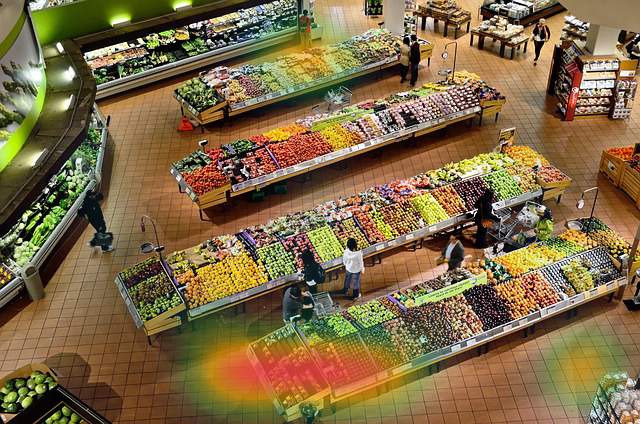
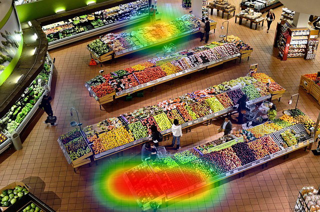

# Heatmap Dot Go


A Go library for generating heatmap visualizations. Create standalone heatmaps or overlay them on existing images — including smooth Gaussian ("thermal camera") mode for realistic blending.

[](https://pkg.go.dev/github.com/galindocode/heatmap-dot-go)
[](https://goreportcard.com/report/github.com/galindocode/heatmap-dot-go)

## Gallery

<table>
<tr>
<td align="center"><b>Gaussian — standalone</b></td>
<td align="center"><b>Foot traffic overlay</b></td>
</tr>
<tr>
<td></td>
<td></td>
</tr>
<tr>
<td align="center"><b>Infrared color scheme</b></td>
<td align="center"><b>Custom gradient (Viridis-style)</b></td>
</tr>
<tr>
<td></td>
<td></td>
</tr>
</table>

## Features

- **Two rendering modes** — hard filled circles (default) or smooth Gaussian blobs for thermal-camera-style output
- **Flexible color gradients** — hex colors (`#RGB`, `#RRGGBB`, `#RRGGBBAA`), any number of stops
- **Dual API** — simple constructor for quick use, fluent builder for advanced configuration
- **Overlay support** — composite a heatmap over any `image.Image` (camera feed, floor plan, map…)
- **Sub-pixel precision** — fractional `float64` coordinates
- **Configurable** — point size, alpha, max value, background color

## Installation

```bash
go get github.com/galindocode/heatmap-dot-go
```

## Quick Start

### Simple API

```go
package main

import "github.com/galindocode/heatmap-dot-go/heatmap"

func main() {
    hm := heatmap.New(800, 600)
    hm.AddPoint(400, 300, 1.0)
    hm.AddPoint(200, 150, 0.5)
    hm.AddPoint(600, 450, 0.8)
    hm.SavePNG("output.png")
}
```

### Builder API

```go
hm, err := heatmap.NewBuilder().
    Size(1920, 1080).
    MaxValue(100).
    Colors("#3b82f6", "#22c55e", "#eab308", "#ef4444").
    PointSize(20).
    Alpha(200).
    Build()
if err != nil {
    log.Fatal(err)
}

hm.AddPoint(960, 540, 75)
hm.AddPoint(400, 300, 50)
hm.SavePNG("output.png")
```

## Gaussian Mode

Gaussian mode renders each point as a **smooth radial blob** using a Gaussian kernel accumulated into a float64 buffer. The result looks like a thermal camera overlay:


- Alpha scales proportionally with intensity — hotspots are opaque, edges fade to fully transparent
- Overlapping points accumulate naturally in the buffer before color mapping
- Produces the smooth blue→green→yellow→red blending typical of retail analytics or crowd tracking

```go
hm := heatmap.New(640, 424)
hm.SetGaussianMode(true)
hm.SetPointSize(60)   // controls blob radius; sigma = radius/3
hm.SetAlpha(200)

hm.AddPoint(320, 212, 1.0)
hm.AddPoint(150, 100, 0.6)
hm.SavePNG("gaussian.png")
```

### Overlay on a camera image


```go
base, err := heatmap.LoadImage("supermarket.jpg")
if err != nil {
    log.Fatal(err)
}

bounds := base.Bounds()
hm := heatmap.New(bounds.Dx(), bounds.Dy())
hm.SetGaussianMode(true)
hm.SetPointSize(60)
hm.SetAlpha(210)

// foot-traffic hotspots
hm.AddPoint(320, 370, 10.0) // checkout queue
hm.AddPoint(320,  60,  6.0) // entrance
hm.AddPoint(120, 200,  3.0) // aisle

pngBytes, err := hm.GenerateOverlayPNG(base)
if err != nil {
    log.Fatal(err)
}
os.WriteFile("overlay.png", pngBytes, 0644)
```

### Builder with Gaussian

```go
hm, err := heatmap.NewBuilder().
    Size(640, 424).
    Colors("#000033", "#0000ff", "#00ffff", "#00ff00", "#ffff00", "#ff4500", "#ff0000").
    PointSize(65).
    Alpha(220).
    MaxValue(10.0).
    Gaussian(true).
    Build()
```

## Rendering Modes

| Feature | Circle (default) | Gaussian |
|---|---|---|
| Edge | Hard | Smooth fade |
| Overlap | Additive pixel blend | Accumulated float buffer |
| Alpha at edge | Fixed | Proportional to intensity |
| Use case | Discrete data, charts | Thermal overlays, foot traffic |

## API Reference

### `heatmap.Heatmap` — simple API

| Method | Description |
|---|---|
| `New(w, h int) *Heatmap` | Create heatmap |
| `AddPoint(x, y, value float64)` | Add data point |
| `SetMaxValue(v float64)` | Max value for gradient (default: auto) |
| `SetAlpha(a uint8)` | Transparency 0–255 (default 180) |
| `SetPointSize(r int)` | Point radius in pixels (default 10) |
| `SetColorScheme([]string)` | Hex color gradient stops |
| `SetBackground(color.Color)` | Background color (default transparent) |
| `SetGaussianMode(bool)` | Enable/disable Gaussian rendering |
| `Clear()` | Remove all points |
| `PointCount() int` | Number of points |
| `Generate() (image.Image, error)` | Render to image |
| `GeneratePNG() ([]byte, error)` | Render to PNG bytes |
| `SavePNG(path string) error` | Render and save file |
| `GenerateOverlay(base image.Image) (image.Image, error)` | Composite over base image |
| `GenerateOverlayPNG(base image.Image) ([]byte, error)` | Composite and return PNG bytes |

### `heatmap.Builder` — fluent API

| Method | Description |
|---|---|
| `NewBuilder() *Builder` | Create builder |
| `Size(w, h int)` | Dimensions |
| `MaxValue(v float64)` | Max gradient value |
| `Colors(colors ...string)` | Variadic hex colors |
| `ColorScheme([]string)` | Slice of hex colors |
| `PointSize(r int)` | Radius in pixels |
| `Alpha(a uint8)` | Transparency 0–255 |
| `Background(color.Color)` | Background color |
| `TransparentBackground()` | Transparent background (default) |
| `Gaussian(bool)` | Enable/disable Gaussian rendering |
| `AddPoint(x, y, v float64)` | Add a point |
| `AddPoints([]Point)` | Add multiple points |
| `Build() (*Heatmap, error)` | Build |
| `MustBuild() *Heatmap` | Build or panic |

### Utility

```go
heatmap.LoadImage(path string) (image.Image, error)
```

Loads PNG or JPEG files.

## Color Schemes

### Defaults (blue → green → yellow → red)

```go
[]string{"#3b82f6", "#22c55e", "#eab308", "#ef4444"}
```

### Infrared / thermal camera


```go
[]string{"#000033", "#0000ff", "#00ffff", "#00ff00", "#ffff00", "#ff4500", "#ff0000"}
```

### Ocean / Viridis-style


```go
[]string{"#0d0887", "#6a00a8", "#b12a90", "#e16462", "#fca636", "#f0f921"}
```

### Supported hex formats

| Format | Example | Notes |
|---|---|---|
| `#RGB` | `#f00` | Expanded to `#ff0000` |
| `#RRGGBB` | `#ff0000` | Standard |
| `#RRGGBBAA` | `#ff0000cc` | Custom alpha per stop |

## Errors

```go
var (
    ErrInvalidSize      // width or height ≤ 0
    ErrNoData           // no data points added
    ErrInvalidMaxValue  // MaxValue ≤ 0 when explicitly set
    ErrInvalidPointSize // PointSize ≤ 0
    ErrInvalidColor     // unrecognised hex string
    ErrInvalidImage     // nil base image passed to overlay
    ErrSizeMismatch     // heatmap and base image dimensions differ
)
```

## Examples

Run the bundled examples:

```bash
go run main.go
# → output_simple.png   simple API, random points
# → output_builder.png  builder API, clustered hotspots
# → output_custom.png   custom 6-stop gradient
```

Integration tests using `supermarket.jpg` produce visual output in `heatmap/testoutput/`:

```bash
go test ./heatmap/... -v -run Supermarket
# → testoutput/supermarket_basic.png
# → testoutput/supermarket_checkout_hotspot.png
# → testoutput/supermarket_infrared.png
# → testoutput/supermarket_gaussian.png
# → testoutput/supermarket_circle.png
```

## Development

```bash
# All tests
go test ./...

# With verbose output
go test -v ./heatmap

# Benchmarks (circle vs Gaussian, splat throughput)
go test -bench=. -benchmem ./heatmap

# Coverage
go test -cover ./heatmap
```

## Use Cases

- **Retail analytics** — foot traffic, dwell time overlaid on floor-plan or camera feed
- **Security** — crowd density on surveillance footage
- **Web analytics** — click maps, scroll depth, eye-tracking
- **Geographic data** — density maps overlaid on maps or satellite imagery
- **Scientific visualization** — temperature distributions, particle density
- **Performance monitoring** — latency hotspots, resource usage

---

**Made with ❤️ by [@galindocode](https://github.com/galindocode)**
